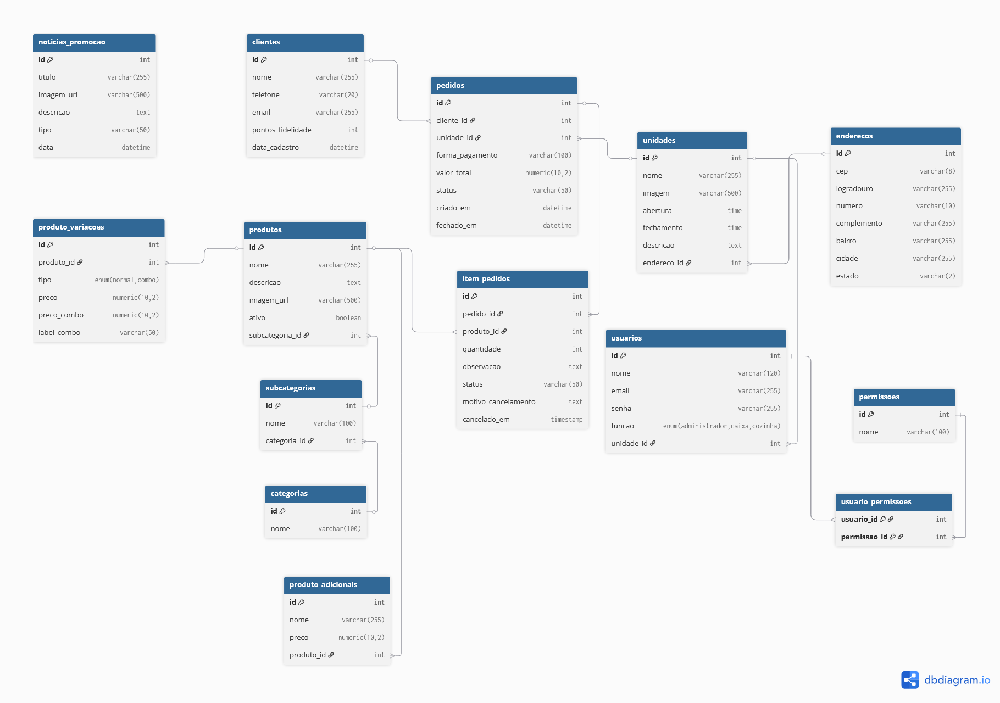

# Diagrama entidade relacionamento

O diagrama entidade-relacionamento (DER) apresenta a estrutura de dados do sistema, incluindo as entidades principais, seus atributos e os relacionamentos entre elas. Ele serve como base para a modelagem do banco de dados e ajuda a identificar como as informações de clientes, pedidos, itens e outros elementos se conectam.

*Figura 1: Diagrama entidade-relacionamento que representa as tabelas e seus relacionamentos no projeto Paraíba Hot Dog.*