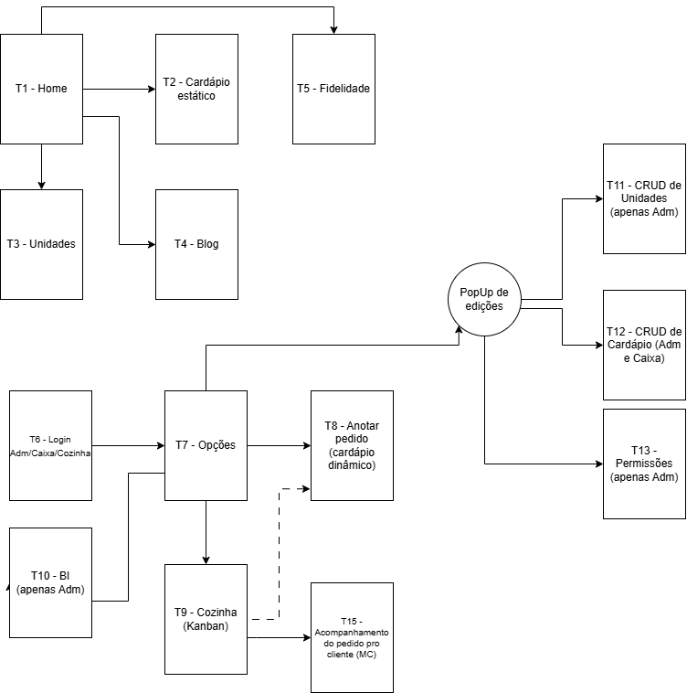

# Fluxo de Telas

O fluxo de telas foi definido para garantir uma navegação simples e intuitiva dentro da aplicação. As etapas seguem uma sequência lógica, guiando o usuário pelas principais funcionalidades de forma clara e eficiente.

O desenho considera usabilidade, organização das informações e redução de passos desnecessários, proporcionando uma experiência mais fluida.

